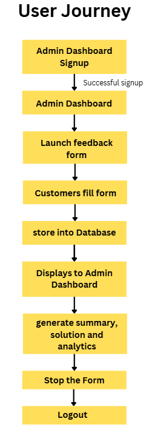

# Customer Review Intelligence Project

---

# Overview:

- This Project uses NLP and machine learning concepts to classify the customer review message or text as “Positive” or “Negative”.   
- Along with the trained NLP model, it uses open source LLM to accept customer reviews and provide better suggestions to improve the service only if the review is classified as “Negative”.  
- Overall, the project automates the review classification to improve company’s services, making decisions or analysing customer’s behavior. 

---

# Problem Statement

- Several Businesses generate a huge number of customer feedbacks or reviews for business decisions and service improvement. Manually reading each customer review and classifying them takes effort and consumes time. 

---

# Solution

- To automate the customer review classification and business decision by leveraging “Machine Learning” and “Natural Language Processing”. The Platform provides an interactive dashboard to accept customer feedback or reviews. At backend, trained model classifies the customer reviews and other parameters and classifies each review as Negative or Positive or Neutral. Additionally, It analyzes the review or set of reviews to suggest business decisions or service improvement.

---

# Expected Outcome

- Customers can easily provide feedback or reviews  
- Model is able to classify the reviews at highest possible accuracy  
- LLM providing logical, practical and accurate business solution with minimal hallucination  
- The entire system works efficiently without any crash, issues or broken logic.

---

# Goal

- To automate customer feedback and business solutions using Machine learning and Natural Language processing.

---

# Features : 

- Interactive Dashboard to accept Customer Feedback  
- High accuracy feedback classification  
- Intelligent business solution generation  
- Efficient and secure data storage  
- Secure Admin Dashboard

---

# Tech Stack

1. Primary language : python >= 3.11  
2. Open source LLM : Ollama (llama 3.1:8b)  
3. Dataset manipulation : pandas, numpy  
4. Database : MySQL 
5. NLP : nltk  
6. Word2vec : genism
7. Machine learning : scikit-learn  
8. Backend : flask  
9. Frontend structure : html   
10. Frontend style : CSS  
11. Frontend logic : Javascript  
12. Model tracking : MLflow  
13. Model serialization : joblib
14. Containerization : docker

---

# Concepts / Technique 

- Text cleaning (using re)  
- Tokenization (using split() )  
- Stopwords (using stopwords)  
- Lemmatization (using WordNetLemmatizer )  
- Word Embedding (using word2vec)  
- Hyperparameter Tuning (GridSearchCV)  
- Cross Validation Score    
- F1 Score, Recall, Precision, Accuracy

# Dataset : 

- Source : [Flipkart Product Review Dataset](https://www.kaggle.com/datasets/niraliivaghani/flipkart-product-customer-reviews-dataset)

## About dataset : 

* This dataset contains information about Product name, Product price, Rate, Reviews, Summary and Sentiment in csv format. There are 104 different types of products of flipkart.com such as electronics items, clothing of men, women and kids, Home decor items, Automated systems, so on. It has 205053 rows and 6 columns. Also, if any product doesn't have any review but summary is present then Nan value already added to its blank space.

* This dataset has multiclass label as sentiment such as positive, neutral amd negative.The sentiment given was based on column called Summary using NLP and Vader model. Also, after that we manually check the label and put it into the appropriate categories like if summary has text like okay, just ok or one positive and negative we labeled as neutral for better understanding while using this dataset for human languages. On the summary and price column, data cleaning method is already performed using python module called NumPy and Pandas which are famous.You can learn it also through any online resource.

* Data was collected through web scraping using the library called beautifulsoup from flipkart.com. The scraping done in december 2022
    
* Features :   
  Review : Product reveiws  
* Target Label:  
  Sentiment : positive, negative, neutral 
* Size : 33.36 MB
* Number of columns : 6

---

# System Architecture

## Low level architecture

```
Customer Feedback Form —-\>  NLP Model \+ LLM —--\>  Database  —--\> Admin Dashboard 
```


![low level architecture][assets/low_architecture.png]  
---

## High Level Architecture 


# Features Breakdown

1. ## Customer feedback Form

Data collected : 

- Personal Information:  
1. Age   
2. Gender   
3. Role   
- Geographic Information:  
1. State  
2. City  
- Customer Feedback : text  
- Rating : 1 \- 5

Buttons : 

- Submit button  
- Clear form button

Programming language 

- HTML  
- CSS  
- Javascript

---

##     2\. Machine learning architecture 

1. ### NLP model 

- Input : customer feedback  
- Output : negative or positive and probability  
- Purpose : to label feedback as positive or negative   
- Algorithm : naive bayes, logistic regression, random forest, LightGBM, XGBoost  
- Evaluation : classification report, accuracy   
- Dataset : [flipkart product review](https://www.kaggle.com/datasets/niraliivaghani/flipkart-product-customer-reviews-dataset)  
- Packages : nltk, scikit-learn, genism, xgboost, lightgbm  
- Programming language : python

2. ### LLM 

- LLM provider : ollama   
- LLM : llama 3.1:8b  
- Input : customer feedback or review   
- Output : service improvement tip in short  
- Purpose : to provide the suggestion or improvement tips for negative feedback

---

##  3\. Database 

- Purpose : To store the Customer feedback and information safely  
    
- Tables :   
1. personal_info  
- id (primary ky)  
- age (integer)  
- gender (varchar)  
- role (varchar)  
- date (DATE)
2. geo_info  
- id (foreign key reference from personal_info)  
- state (varchar)  
- city (varchar)  
3. reviews  
- id (foreign key reference from personal_info)  
- feedback (text)  
- output (varchar) -> negative or positive or neutral  
- Probability score (decimal)  
4. items
- id (foreign key references from personal_info)
- rating (integer)
- product (decimal) 
5. admin
- admin_id (auto_increment)
- email
- password
- register_date 

- Database Language : MySQL  
- Programming language : python

---

##    4\. Admin Panel / Dashboard 

- Purpose : to analyse the customer feedbacks and provide business solutions and analytics.  
- Components :   
1. Customer information table: this fetches all information about the customer from the database and represents it as a table for view and manual analysis by admin.  
2. Analytics :   
- Total feedbacks (integer)  
- Age distribution (students, young adults, adults, old age)  
- Gender count by male and female    
- Geographic locations by cities or states (map of India)  
- Role count distribution (bar graph)  
- Feedback results (count of positive and negative feedbacks)  
- Average rating   
3. Feedback Summary by LLM  
4. Business Solution by LLM  
5. Buttons :   
- Generate feedback summary button (generates the summary of all feedbacks)  
- Generate solution button (analyse the feedbacks or reviews and provide high level business solution)  
- Launch feedback form button (starts accepting user feedback by launching form)   
- Refresh button (refresh the page)
- Logout Button
- Close Form Button

---

## User journey / Workflow 

- This shows the steps user should follow to run the system or get results.

### Steps: 
**User : Admin**



---

### Explanation:

1. Admin creates account or sign up for *Admin Dashboard*. Admin must provide the passowrd and email for signup.
2. Admin is directed to main admin dashboard after successful signup where admin can control, view customer data and generate solutions.
3. Admin must launch the *Customer Feedback Form* which start accepting customer reviews or feedback by clicking **Launch Feedback Form** button.
4. After launching the feedback form, customer fills the data provided in the form.
5. Trained *NLP model* is responsible to label the review as either *positive* or *negative* or *neutral* on the basis of customer reviews submit through form.
6. All data generated through customer and NLP model is safely stored in the *mysql database*.
7. Admin Dashboard fetches all the related data from database and displays them in clean tabular format.
8. Click *generate feedback summary* button to generate a summary of all the reviews provided by customers.
9. Click "generate solution" button to analyse the *negative* reviews and provide concise, accurate and logical solution by *LLM*.
10. Click *Close Form* button to stop accepting customer reviews.
11. Click *logout* button to quit the Admin Dashboard.
12. *Log in* successfully to review the customer data, summary, soluion and analytics.
