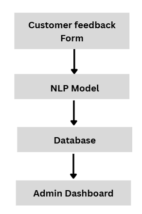
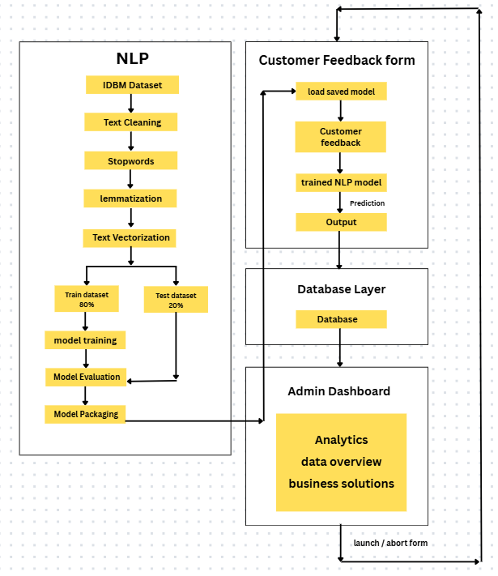

# Customer Review Intelligence Project

---

# Overview:

- This Project uses NLP and machine learning concepts to classify the customer review message or text as “Positive” or “Negative”.   
- Along with the trained NLP model, it uses open source LLM to accept customer reviews and provide better suggestions to improve the service only if the review is classified as “Negative”.  
- Overall, the project automates the review classification to improve company’s services, making decisions or analysing customer’s behavior. 

---

# Problem Statement

- Several Businesses generate a huge number of customer feedbacks or reviews for business decisions and service improvement. Manually reading each customer review and classifying them takes effort and consumes time. 

---

# Solution

- To automate the customer review classification and business decision by leveraging “Machine Learning” and “Natural Language Processing”. The Platform provides an interactive dashboard to accept customer feedback or reviews. At backend, trained model classifies the customer reviews and other parameters and classifies each review as Negative or Positive. Additionally, It analyzes the review or set of reviews to suggest business decisions or service improvement.

---

# Expected Outcome

- Customers can easily provide feedback or reviews  
- Model is able to classify the reviews at highest possible accuracy  
- LLM providing logical, practical and accurate business solution without hallucination  
- The entire system works efficiently without any crash, issues or broken logic.

---

# Goal

- To automate customer feedback and business solutions using Machine learning and Natural Language processing.

---

# Features : 

- Interactive Dashboard to accept Customer Feedback  
- High accuracy feedback classification  
- Intelligent business solution generation  
- Efficient and secure data storage  
- Secure Admin Dashboard

---

# Tech Stack

1. Primary language : python \>= 3.11  
2. Open source LLM : Ollama (llama 3.1:8b)  
3. Dataset manipulation : pandas, numpy  
4. Database : PostgreSQL / MongoDB (yet to decide)  
5. NLP : nltk  
6. Word2vec : gensi  
7. Machine learning : scikit-learn  
8. Backend : flask  
9. Frontend structure : html   
10. Frontend style : CSS  
11. Frontend logic : Javascript  
12. Model tracking : MLflow  
13. Model packaging : Bento  
14. Containerization : docker

---

# Concepts / Technique 

- Text cleaning (using re)  
- Tokenization (using word\_tokenize )  
- Stopwords (using stopwords)  
- Lemmatization (using WordNetLemmatizer )  
- Word Embedding (using word2vec)  
- Hyperparameter Tuning (GridSearchCV)  
- Cross Validation Score  
- Stratified-K-Fold  
- Classification Report

# Dataset : 

- Source : [https://www.kaggle.com/datasets/lakshmi25npathi/imdb-dataset-of-50k-movie-reviews](https://www.kaggle.com/datasets/lakshmi25npathi/imdb-dataset-of-50k-movie-reviews)

## About dataset : 

* IMDB dataset having 50K movie reviews for natural language processing or Text analytics.  
* This is a dataset for binary sentiment classification containing substantially more data than previous benchmark datasets. We provide a set of 25,000 highly polar movie reviews for training and 25,000 for testing. So, predict the number of positive and negative reviews using either classification or deep learning algorithms.   
    
* Features :   
  Review : movie reviews   
* Target Label:  
  Sentiment : positive, negative  
* Unique values : 49582  
* Size : 66.21 MB

---

# System Architecture

## Low level architecture

```
Customer Feedback Form —-\>  NLP Model \+ LLM —--\>  Database  —--\> Admin Dashboard 
```


---

## High Level Architecture 



# Features Breakdown

1. ## Customer feedback Form

Data collected : 

- Personal Information:  
1. Age   
2. Gender   
3. Role   
- Geographic Information:  
1. State  
2. City  
- Customer Feedback : text  
- Rating : 1 \- 5

Buttons : 

- Submit button  
- Clear form button

Programming language 

- HTML  
- CSS  
- Javascript

---

##     2\. Machine learning architecture 

1. ### NLP model 

- Input : customer feedback  
- Output : negative or positive and probability  
- Purpose : to label feedback as positive or negative   
- Algorithm : naive bayes, logistic regression, random forest, LightGBM, XGBoost  
- Evaluation : classification report, accuracy   
- Dataset : [idmb\_movie\_dataset](https://www.kaggle.com/datasets/lakshmi25npathi/imdb-dataset-of-50k-movie-reviews)  
- Packages : nltk, scikit-learn, genism, xgboost, lightgbm  
- Programming language : python

2. ### LLM 

- LLM provider : ollama   
- LLM : llama 3.1:8b  
- Input : customer feedback or review   
- Output : service improvement tip in short  
- Purpose : to provide the suggestion or improvement tips for negative feedback

---

##  3\. Database 

- Purpose : To store the Customer feedback and information safely  
    
- Tables :   
1. personal\_info  
- id (primary ky)  
- Age (integer)  
- Gender (varchar)  
- Role (varchar)  
2. geo\_info  
- id (foreign key reference from personal\_info)  
- State (varchar)  
- City (varchar)  
3. Reviews  
- id (foreign key reference from personal\_info)  
- Feedback (text)  
- Output (varchar) \-\> negative or positive  
- Probability score (decimal)  
4. admin\_users  
- User name  
- Encrypted password  
- email\_id 

- Database Language : PostgreSQL or MySQL  
- Programming language : python

---

##    4\. Admin Panel / Dashboard 

- Purpose : to analyse the customer feedbacks and provide business solutions and analytics.  
- Components :   
1. Customer information table: this fetches all information about the customer from the database and represents it as a table for view and manual analysis by admin.  
2. Analytics :   
- Total feedbacks (integer)  
- Age distribution (students, young adults, adults, old age)  
- Gender count by male and female    
- Geographic locations by cities or states (map of India)  
- Role count distribution (bar graph)  
- Feedback results (count of positive and negative feedbacks)  
- Average rating   
3. Feedback Summary by LLM  
4. Business Solution by LLM  
5. Buttons :   
- Generate feedback summary button (generates the summary of all feedbacks)  
- Generate solution button (analyse the feedbacks or reviews and provide high level business solution)  
- Launch feedback form button (starts accepting user feedback by launching form)   
- Refresh button (refresh the page)
- Logout Button
- Close Form Button

---

## User journey / Workflow 

- This shows the steps user should follow to run the system or get results.

### Steps: 
**User : Admin**

1. Admin creates account or sign up for *Admin Dashboard*. Admin must provide the passowrd and email for signup.
2. Admin is directed to main admin dashboard after successful signup where admin can control, view customer data and generate solutions.
3. Admin must launch the *Customer Feedback Form* which start accepting customer reviews/feedback by clicking **Launch Customer Form** button.
4. After launching the feedback form, customer fills the data provided in the form.
5. Trained *NLP model* is responsible to label the review as either *positive* or *negative* on the basis of customer reviews submit through form.
6. All data generated through customer and NLP model is safely stored in the *database*.
7. Admin Dashboard fetches all the related data from database and displays them in clean tabular format.
8. Click *generate summary* button to generate a summary of all the reviews provided by customers.
9. Click "generate solution" button to analyse the *negative* reviews and provide concise, accurate and logical solution by *LLM*.
10. Click *Close Form* button to stop accepting customer reviews.
11. Click *logout* button to quit the Admin Dashboard.
12. *Log in* successfully to review the customer data, summary, soluion and analytics.
